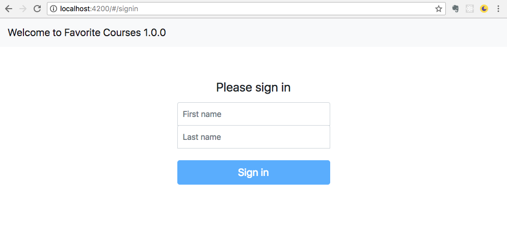
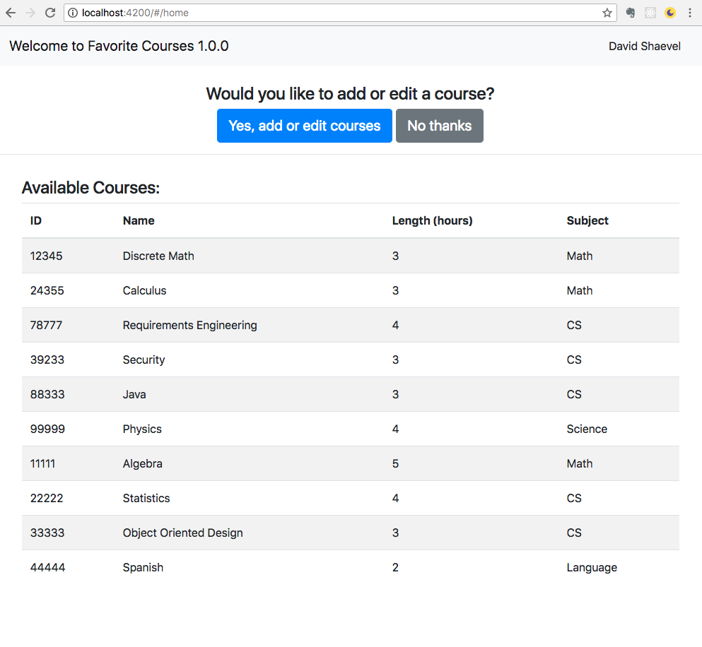
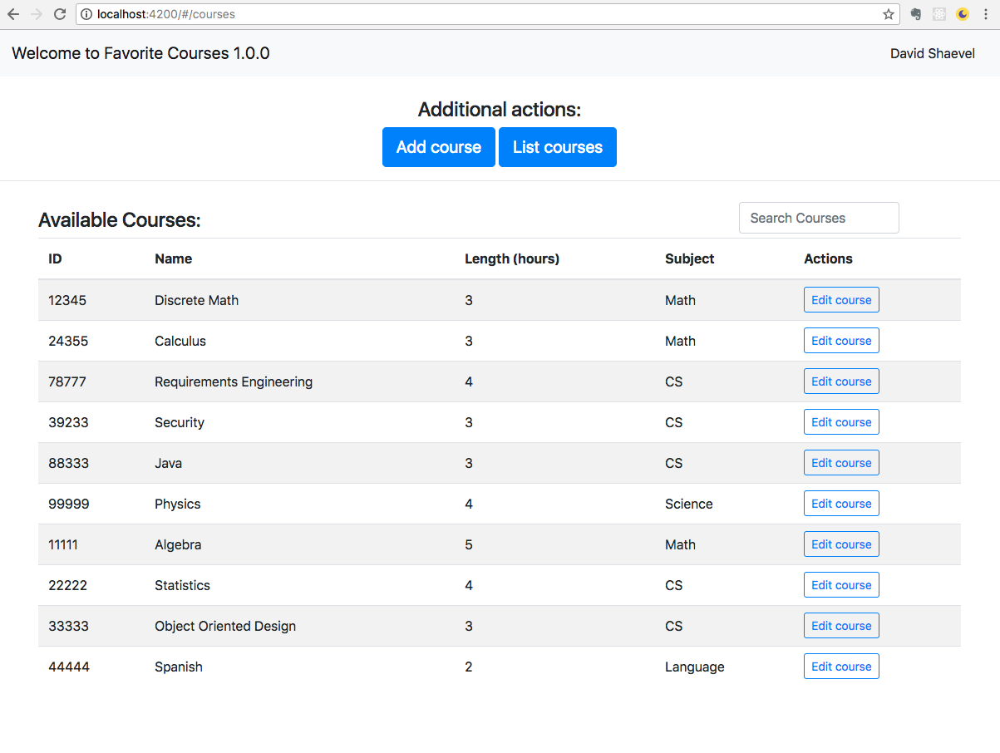
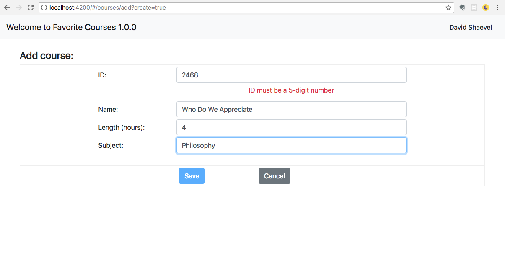
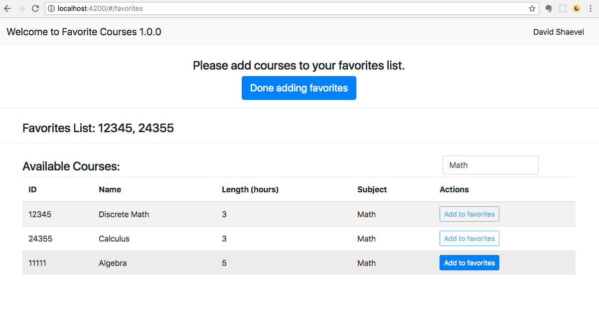
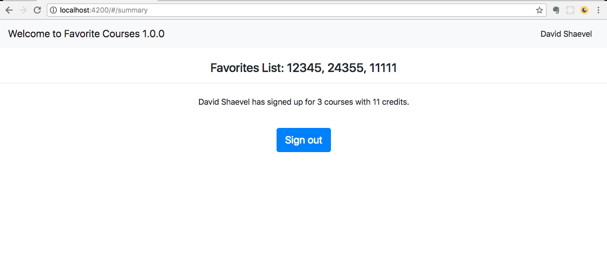

# Favorite Courses - v1.0.0 - David Shaevel
### 04/24/2018

---

## Description
Create a program that models a learning system.

You will have a list of courses that you need to load (see attached courses.txt). Each course will have the following fields: course id, course name (could have spaces in name), course length (in hours), course subject. First you need to read in all the courses which will be in the format of: Id name length subject. Each line will be a new course.

After the courses are loaded, your program should ask the user for their name. After the user enters their name, your program should list all the courses and then ask the user if they would like to input or edit a course. You can choose any method of input (please add the method in the readme). Then the program should prompt the user for choices of (add, edit, list, and search). The following operations should be supported:

1. **Add:** the program should prompt the user to add a course. Once the choice has been made, your program should request the user to input all the required fields for the course and add the course to the previously defined list.
2. **Edit:** the program should first list the courses and prompt the user for an id to edit. Once the user inputs an id, the program should prompt the user for a field to edit and an edit value. Then the program should update the field with the new edit.
3. **List:** the program should list all the courses.
4. **Search:** the program should take in any input and search the courses and list any courses with matching fields (all the fields should be searched)

At the end of each operation the program should prompt the user for any additional operations. If the user says “yes”, the program should prompt the user for any operations (1-4). If the user says “no”, the program should prompt the user to add courses to a “favorites” list (comma separated ids). The program should print the favorites list and calculate the following total course hours: sum of each course * course hours. The following text should be then outputted:

```<user name inputted> has signed up for <number of courses> courses with <total course hours> credits```

The program should then terminate.

## Installation and Usage
The Favorite Courses project consists of a server hosting an API endpoint using Express and a client web application using Angular 5.2.

1. Install the server:

    ```
    $ npm install
    ```

2. Install the client:

    ```
    $ cd client
    $ npm install
    ```

3. Start Express and Angular concurrently (**Note:** only dev mode is supported at the moment):

    ```
    $ cd ..
    $ npm run dev
    ```

    This will start Express on port 3000 using nodemon and Angular on port 4200 using ng serve:

    ```
    [nodemon] 1.17.3
    [nodemon] to restart at any time, enter `rs`
    [nodemon] watching: *.*
    Listening on port 3000
    ** NG Live Development Server is listening on localhost:4200, open your browser on http://localhost:4200/ **
    ```

4. Verify that Express is responding to requests to the ```/v1/courses``` API:

    ```
    $ curl -XGET 'http://localhost:3000/v1/courses'
    [{"id":"12345","name":"Discrete Math","length":3,"subject":"Math"},{"id":"24355","name":"Calculus","length":3,"subject":"Math"},{"id":"78777","name":"Requirements Engineering","length":4,"subject":"CS"},{"id":"39233","name":"Security","length":3,"subject":"CS"},{"id":"88333","name":"Java","length":3,"subject":"CS"},{"id":"99999","name":"Physics","length":4,"subject":"Science"},{"id":"11111","name":"Algebra","length":5,"subject":"Math"},{"id":"22222","name":"Statistics","length":4,"subject":"CS"},{"id":"33333","name":"Object Oriented Design","length":3,"subject":"CS"},{"id":"44444","name":"Spanish","length":2,"subject":"Language"}]
    ```

5. Open your browser to ```http://localhost:4200``` and sign in!

Sign In


Home Page


Course List Page


Add Course Page


Favorite Courses Page


Summary Page

